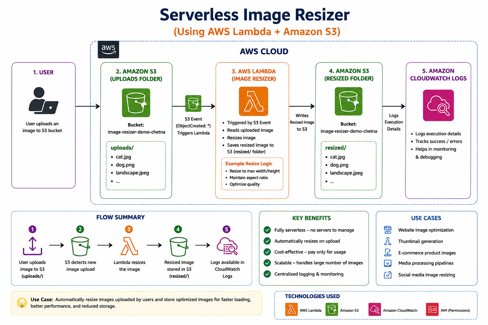
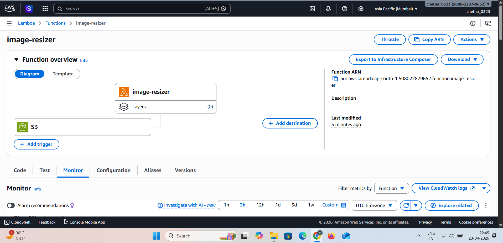
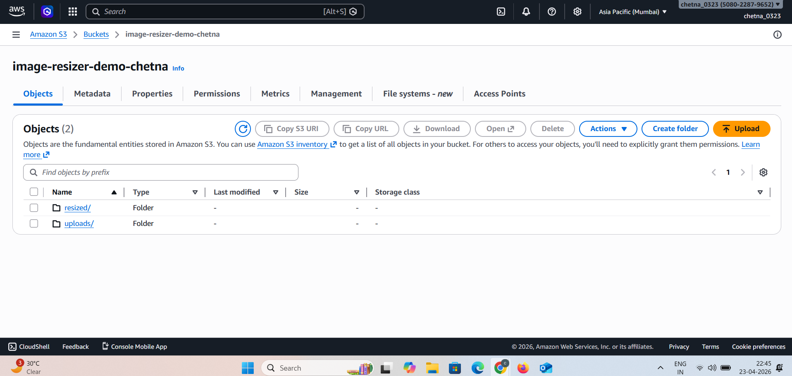
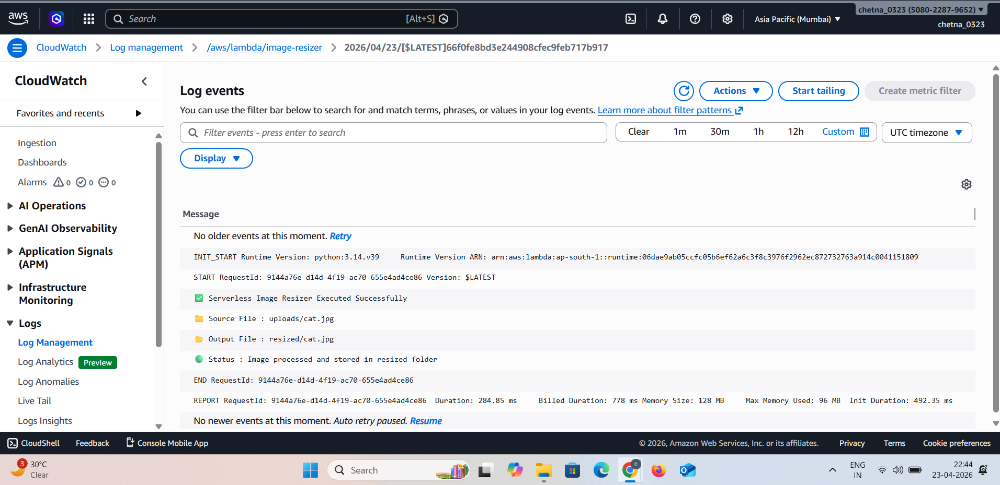

📸 Serverless Image Resizer

🎯 Purpose

Automatically resize images when they are uploaded to an S3 bucket using AWS Lambda (serverless architecture).

---

🧰 AWS Services Used

* AWS Lambda
* Amazon S3
* Amazon CloudWatch
* IAM (Roles & Permissions)

---

🏗️ Architecture Diagram



---

🔄 Architecture Flow

User Uploads Image → S3 Bucket (uploads folder) → Lambda Trigger → Image Processing → S3 Bucket (resized folder) → CloudWatch Logs

---

⚙️ How It Works

1. User uploads an image to the **uploads/** folder in S3
2. S3 event triggers the Lambda function
3. Lambda processes the image using Python (resize logic)
4. Resized image is stored in **resized/** folder
5. Logs are recorded in CloudWatch

---

⚡ AWS Lambda Function



👉 This function:

* Detects uploaded image
* Resizes it
* Stores output in another folder

---

📦 S3 Bucket Structure



👉 Bucket contains:

* uploads/ → original images
* resized/ → processed images

---

📊 CloudWatch Logs



👉 Logs show:

* Image processing status
* File paths (input/output)
* Execution success

---

🚀 Key Features

* Fully serverless (no servers to manage)
* Automatic image processing
* Cost-efficient (pay only when triggered)
* Scalable for large uploads
* Real-time processing

---

📌 Use Case

* Image optimization for websites
* Thumbnail generation
* Media processing pipelines

---

📁 Project Structure

```
serverless-image-resizer/
│
├── lambda_function.py
├── README.md
└── screenshots/
    ├── architecture.png
    ├── lambda.png
    ├── s3.png
    └── cloudwatch.png
```

---

✅ Output

* Image uploaded → automatically resized
* Stored in S3 without manual work
* Logs available for monitoring

---

💡 Conclusion

This project demonstrates how to build a **fully automated, event-driven serverless system** using AWS services. It eliminates manual effort and scales effortlessly.

---
